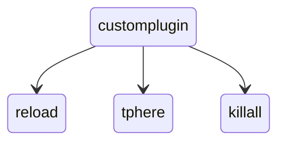
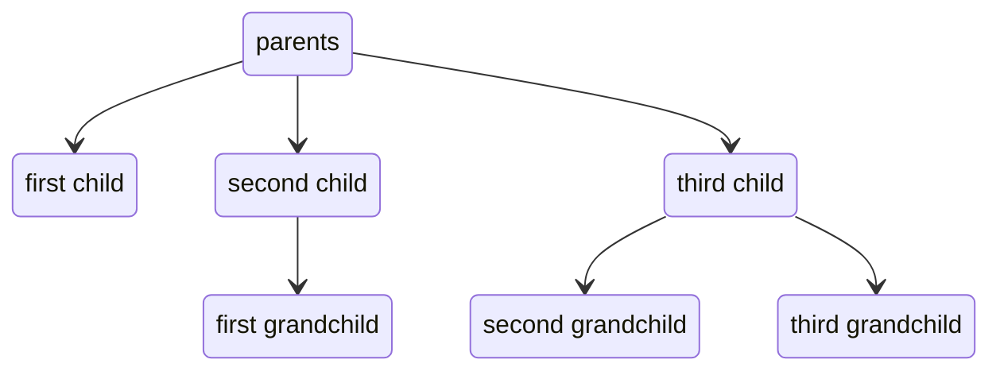
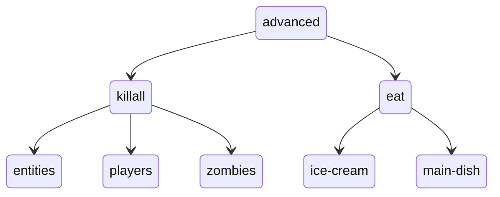
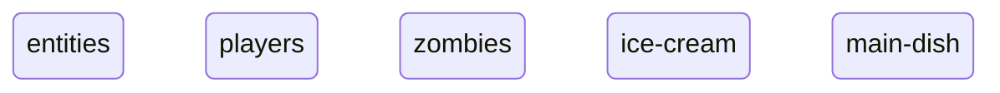
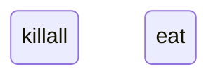
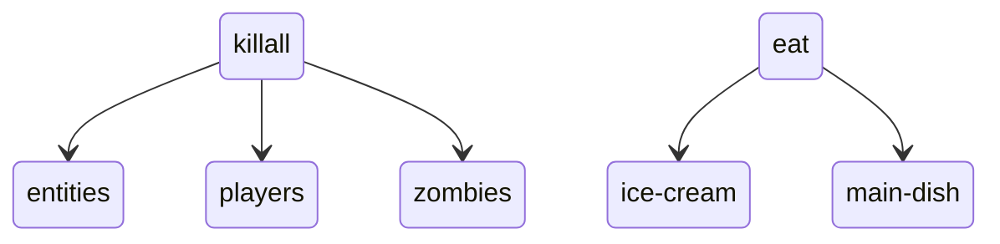

import Tree from "./assets/forest/tree.png";
import DescribedTree from "./assets/forest/tree-descriptions.png";

# Brigadier 命令树
什么是命令树？它与 Brigadier 有什么关系？如果你对此感到困惑，这篇文章正适合你！在这里，我们将详细了解
理解命令树所需的所有知识！

:::note

这是关于 Brigadier 命令结构的完整教程。本页面不提供关于执行分支或一般参数的信息，仅涉及字面量。
如果你是 Brigadier 编程的新手，建议你阅读这部分内容。

:::

## 什么是树？
说到树，首先想到的是野外的树。它可能看起来像这样：


那么，这与命令有什么关系呢？想象一个这样的命令：

```yml title="一个通用命令"
/customplugin reload
/customplugin tphere
/customplugin killall
```

为了简单起见，我们将 `/customplugin`（不带任何参数）称为我们的"命令"或"树"根。根之后的每个参数被称为"分支"。
你可以在我们的通用树上这样可视化它：


每次都这样画树很累，而且通常无法说明问题。我们可以使用**树形图**来可视化树。它看起来是这样的：
<p align="center">

</p>

现在更容易理解元素之间的根/分支关系了。根节点是位于我们层次结构顶部的节点。在这种情况下，就是 'customplugin' 节点。
其他元素有一个指向它们的箭头，这意味着它们是我们根节点的**分支**，也称为子节点。家谱树遵循类似的结构，如下所示：
<p align="center">

</p>

重要的是要记住，这种树状结构不仅对 Brigadier 重要。这是一个相当常用的概念。Paper 包含的 [Adventure API](../../component-api/intro.mdx)
也使用树状结构运作。但这对使用 Brigadier 为什么重要呢？因为它允许显式命令声明。在一个节点上，你确切地知道你在哪里。这意味着你不必
像标准 Bukkit 方式那样，先检查参数数量是否为 2，第一个参数是否为 `tphere`。因为你正好在那个 `tphere` 节点上，你可以直接开始编写
你的逻辑。如果你想了解更多关于 Brigadier 命令的执行逻辑，建议你查看[命令执行器](./executors)。

## 如何在代码中可视化树？
我们可以这样定义我们的根：

```java
LiteralArgumentBuilder<CommandSourceStack> root = Commands.literal("customplugin");
```

这个方法返回一个 `LiteralArgumentBuilder<CommandSourceStack>`，这是一个允许我们使用 `.then(...)` 方法向其添加分支的类，像这样：

```java
LiteralArgumentBuilder<CommandSourceStack> root = Commands.literal("customplugin");
root.then(Commands.literal("reload"));
root.then(Commands.literal("tphere"));
root.then(Commands.literal("killall"));
```

每个 `.then(...)` 方法都向我们的根添加一个新分支。你可能注意到了这里重复使用了 `Commands.literal(String)`。它不仅定义了我们命令的树根，
还定义了我们的"子命令"（`reload`、`tphere` 和 `killall`）。每个"子"字面量被称为其父节点的子命令。

## 创建更高级的命令
但如果我们想要一个更复杂的命令呢？假设我们想定义以下命令：

```yml title="高级命令"
/advanced
 ┣━┳ killall
 ┃ ┣━━ entities
 ┃ ┣━━ players
 ┃ ┗━━ zombies
 ┗━┳ eat
   ┣━━ ice-cream
   ┗━━ main-dish
```

它允许在游戏中执行以下命令：

```
/advanced killall entities
/advanced killall players
/advanced killall zombies
/advanced eat ice-cream
/advanced eat main-dish
```

由于这是一个相当复杂的命令，我们可以先将其可视化为树形图，以便更好地理解发生了什么：

<p align="center">

</p>

定义了我们的目标命令后，我们现在该如何处理呢？有几种可能的方法，但最简单的是先定义**离根最远的**。这意味着我们首先
定义整个树的最后分支。也就是说，那些没有子命令的分支：

```java
LiteralArgumentBuilder<CommandSourceStack> entities = Commands.literal("entities");
LiteralArgumentBuilder<CommandSourceStack> players = Commands.literal("players");
LiteralArgumentBuilder<CommandSourceStack> zombies = Commands.literal("zombies");

LiteralArgumentBuilder<CommandSourceStack> iceCream = Commands.literal("ice-cream");
LiteralArgumentBuilder<CommandSourceStack> mainDish = Commands.literal("main-dish");
```

这给了我们树中最深的元素。
<p align="center">

</p>

现在，我们可以定义下一层字面量：即 `killall` 和 `eat`：
```java
LiteralArgumentBuilder<CommandSourceStack> killall = Commands.literal("killall");
LiteralArgumentBuilder<CommandSourceStack> eat = Commands.literal("eat");
```

在我们的树形图中可视化：
<p align="center">

</p>

定义了这些后，我们可以将子元素添加到它们的父元素中，像这样：
```java
killall.then(entities);
killall.then(players);
killall.then(zombies);

eat.then(iceCream);
eat.then(mainDish);
```

这给了我们这个有点像树的结构
<p align="center">

</p>

最后，我们可以创建我们的**根节点**并向其添加 `killall` 和 `eat` 子命令：

```java
LiteralArgumentBuilder<CommandSourceStack> advancedCommandRoot = Commands.literal("advanced");
advancedCommandRoot.then(killall);
advancedCommandRoot.then(eat);
```

这返回最终的命令树：
<p align="center">

</p>

大功告成！

## 链式调用 'then' 方法
你可能注意到了，必须为每个子节点存储一个单独的变量感觉不必要的冗长。但这就是 `.then()` 参数的救星之处。它返回与调用它的相同元素。
这意味着如果我们运行这段代码：

```java
LiteralArgumentBuilder<CommandSourceStack> value = killall.then(entities);
if (value == killall) {
    logger.info("返回值与 killall 相同");
}
```

我们总是会看到打印出"返回值与 killall 相同"。我们可以利用这一点将 `then(...)` 调用链接在一起，像这样：

```java
killall.then(entities).then(players).then(zombies);
```

由于这样难以阅读，我们应该为每个分支使用新的一行：

```java
killall
    .then(entities)
    .then(players)
    .then(zombies);
```

这样，我们也不必为每个字面量存储单独的变量，而是可以直接将它们传递给 `.then(...)` 方法：

```java
killall
    .then(Commands.literal("entities"))
    .then(Commands.literal("players"))
    .then(Commands.literal("zombies"));
```

对 `eat` 子命令也可以做同样的事：

```java
eat
    .then(Commands.literal("ice-cream"))
    .then(Commands.literal("main-dish"));
```

进一步利用 `then` 方法的构建器模式，我们可以在初始创建子命令时直接放置这些链式分支。像这样：

```java
LiteralArgumentBuilder<CommandSourceStack> eat = Commands.literal("eat")
    .then(Commands.literal("ice-cream"))
    .then(Commands.literal("main-dish"));

LiteralArgumentBuilder<CommandSourceStack> killall = Commands.literal("killall")
    .then(Commands.literal("entities"))
    .then(Commands.literal("players"))
    .then(Commands.literal("zombies"));


LiteralArgumentBuilder<CommandSourceStack> advancedCommandRoot = Commands.literal("advanced");
advancedCommandRoot.then(eat);
advancedCommandRoot.then(killall);
```

现在，你可能注意到我们的根节点也使用 `.then(...)` 方法注册其分支，这意味着我们也可以组合这些：

```java
LiteralArgumentBuilder<CommandSourceStack> advancedCommandRoot = Commands.literal("advanced")
    .then(Commands.literal("eat")
        .then(Commands.literal("ice-cream"))
        .then(Commands.literal("main-dish"))
    )
    .then(Commands.literal("killall")
        .then(Commands.literal("entities"))
        .then(Commands.literal("players"))
        .then(Commands.literal("zombies"))
    );
```

这就完成了命令！

:::warning

在嵌套分支时你必须非常小心，因为当你放错括号时，命令会变成完全不同的东西。

:::