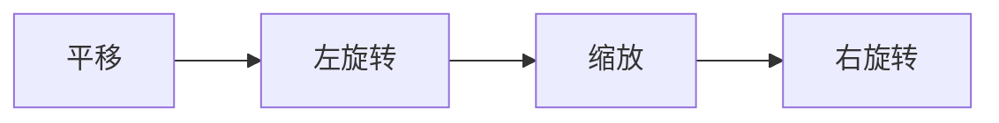
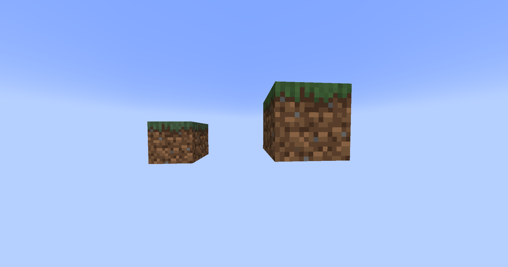
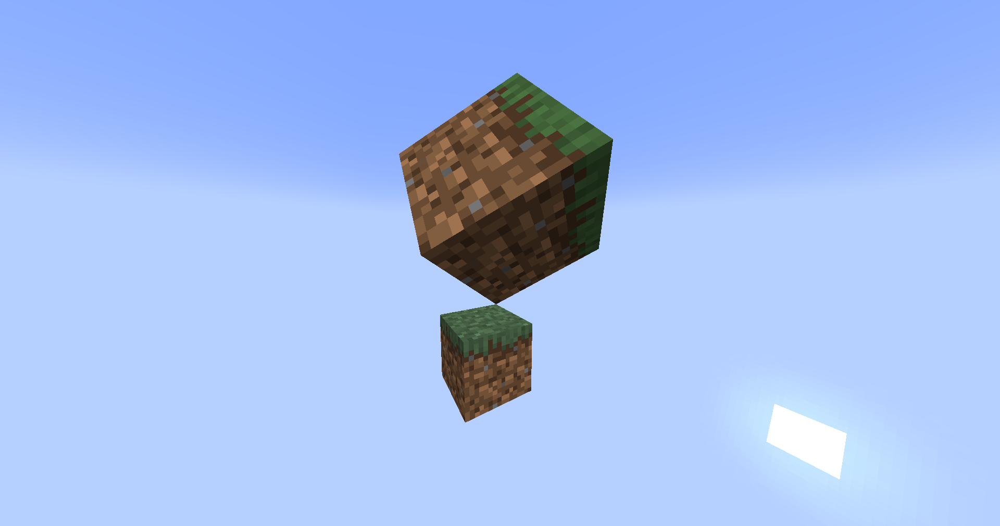
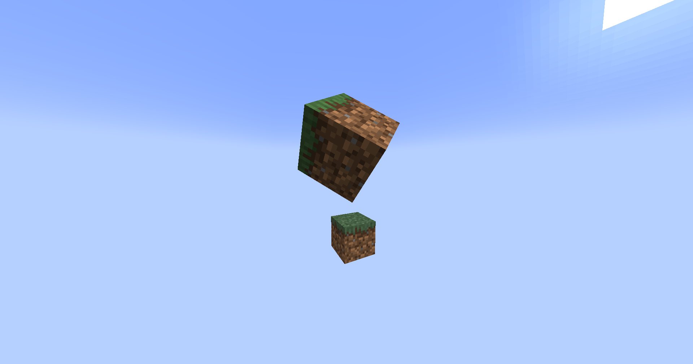

# 显示实体

在1.19.4中添加的[显示实体](https://minecraft.wiki/w/Display)是一种在世界中显示各种内容的强大方式,如方块、物品和文本。

默认情况下,这些实体没有碰撞箱,不会移动,不会发出声音或受到伤害,这使它们成为各种应用(如全息图)的完美选择。

## 类型

### 文本

可以通过<Javadoc name={"org.bukkit.entity.TextDisplay"}>`TextDisplay`</Javadoc>实体显示文本。

```java
TextDisplay display = world.spawn(location, TextDisplay.class, entity -> {
    // 自定义实体!
    entity.text(Component.text("一些很棒的内容", NamedTextColor.BLACK));
    entity.setBillboard(Display.Billboard.VERTICAL); // 仅围绕垂直轴旋转
    entity.setBackgroundColor(Color.RED); // 将背景设为红色

    // 查看Display和TextDisplay的Javadoc,还有更多选项
});
```

### 方块

可以通过<Javadoc name={"org.bukkit.entity.BlockDisplay"}>`BlockDisplay`</Javadoc>实体显示方块。

```java
BlockDisplay display = world.spawn(location, BlockDisplay.class, entity -> {
    // 自定义实体!
    entity.setBlock(Material.GRASS_BLOCK.createBlockData());
});
```

### 物品

可以通过<Javadoc name={"org.bukkit.entity.ItemDisplay"}>`ItemDisplay`</Javadoc>实体显示物品。

尽管名字如此,物品显示也可以显示方块,区别在于模型中的位置 - 物品显示的位置在中心,而方块显示的位置在方块的角落(这可以通过碰撞箱调试模式 - F3+B看到)。

```java
ItemDisplay display = world.spawn(location, ItemDisplay.class, entity -> {
    // 自定义实体!
    entity.setItemStack(ItemStack.of(Material.SKELETON_SKULL));
});
```

## 变换

显示可以应用任意仿射变换,允许你在3D空间中随意定位和扭曲它们。

变换按以下顺序应用到显示上:



:::tip[可视化变换]

使用[变换可视化工具](https://misode.github.io/transformation/)网站来可视化变换,以便快速原型设计!

:::

### 缩放

最基本的变换是缩放,让我们拿一个草方块并放大它:

```java
world.spawn(location, BlockDisplay.class, entity -> {
    entity.setBlock(Material.GRASS_BLOCK.createBlockData());
    entity.setTransformation(
        new Transformation(
                new Vector3f(), // 不平移
                new AxisAngle4f(), // 不左旋转
                new Vector3f(2, 2, 2), // 在所有轴上放大2倍
                new AxisAngle4f() // 不右旋转
        )
    );
    // 或者从JOML设置原始变换矩阵
    // entity.setTransformationMatrix(
    //         new Matrix4f()
    //                 .scale(2) // 在所有轴上放大2倍
    // );
});
```



### 旋转

你也可以旋转它,让我们把它倾斜到角落:

```java
world.spawn(location, BlockDisplay.class, entity -> {
    entity.setBlock(Material.GRASS_BLOCK.createBlockData());
    entity.setTransformation(
        new Transformation(
                new Vector3f(), // 不平移
                // highlight-next-line
                new AxisAngle4f((float) -Math.toRadians(45), 1, 0, 0), // 在X轴上旋转-45度
                new Vector3f(2, 2, 2), // 在所有轴上放大2倍
                // highlight-next-line
                new AxisAngle4f((float) Math.toRadians(45), 0, 0, 1) // 在Z轴上旋转+45度
        )
    );
    // 或者从JOML设置原始变换矩阵
    // entity.setTransformationMatrix(
    //         new Matrix4f()
    //                 .scale(2) // 在所有轴上放大2倍
                       // highlight-start
    //                 .rotateXYZ(
    //                         (float) Math.toRadians(360 - 45), // 在X轴上旋转-45度
    //                         0,
    //                         (float) Math.toRadians(45) // 在Z轴上旋转+45度
    //                 )
                       // highlight-end
    // );
});
```



### 平移

最后,我们还可以对显示应用平移变换(位置偏移),例如:

```java
world.spawn(location, BlockDisplay.class, entity -> {
    entity.setBlock(Material.GRASS_BLOCK.createBlockData());
    entity.setTransformation(
        new Transformation(
                // highlight-next-line
                new Vector3f(0.5F, 0.5F, 0.5F), // 在所有轴上偏移半个方块
                new AxisAngle4f((float) -Math.toRadians(45), 1, 0, 0), // 在X轴上旋转-45度
                new Vector3f(2, 2, 2), // 在所有轴上放大2倍
                new AxisAngle4f((float) Math.toRadians(45), 0, 0, 1) // 在Z轴上旋转+45度
        )
    );
    // 或者从JOML设置原始变换矩阵
    // entity.setTransformationMatrix(
    //         new Matrix4f()
                       // highlight-next-line
    //                 .translate(0.5F, 0.5F, 0.5F) // 在所有轴上偏移半个方块
    //                 .scale(2) // 在所有轴上放大2倍
    //                 .rotateXYZ(
    //                         (float) Math.toRadians(360 - 45), // 在X轴上旋转-45度
    //                         0,
    //                         (float) Math.toRadians(45) // 在Z轴上旋转+45度
    //                 )
    // );
});
```



## 插值

客户端可以线性插值变换以创建平滑动画,从一个变换切换到下一个变换。

一个例子就是平滑地原地旋转一个方块/物品/文本。结合[调度器API](../scheduler.mdx),动画可以在完成后重新启动,使显示无限旋转:

```java
ItemDisplay display = location.getWorld().spawn(location, ItemDisplay.class, entity -> {
    entity.setItemStack(ItemStack.of(Material.GOLDEN_SWORD));
});

int duration = 5 * 20; // 半圈旋转的持续时间(5 * 20刻 = 5秒)

Matrix4f mat = new Matrix4f().scale(0.5F); // 缩放到0.5倍 - 更小的物品
Bukkit.getScheduler().runTaskTimer(plugin, task -> {
    if (!display.isValid()) { // 显示从世界中移除,中止任务
        task.cancel();
        return;
    }

    display.setTransformationMatrix(mat.rotateY(((float) Math.toRadians(180)) + 0.1F /* 防止客户端反向插值 */));
    display.setInterpolationDelay(0); // 插值无延迟
    display.setInterpolationDuration(duration); // 设置插值旋转的持续时间
}, 1 /* 从显示创建延迟一刻开始初始变换 */, duration);
```


## 用例

显示有许多不同的用例,从固定装饰到复杂动画。

一个流行的简单用例是制作只对特定玩家可见的装饰,这可以通过标准实体API实现 - <Javadoc name={"org.bukkit.entity.Entity#setVisibleByDefault(boolean)"}>`Entity#setVisibleByDefault()`</Javadoc>
和<Javadoc name={"org.bukkit.entity.Player#showEntity(org.bukkit.plugin.Plugin,org.bukkit.entity.Entity)"}>`Player#showEntity()`</Javadoc>/
<Javadoc name={"org.bukkit.entity.Player#hideEntity(org.bukkit.plugin.Plugin,org.bukkit.entity.Entity)"}>`Player#hideEntity()`</Javadoc>。

:::warning

如果显示只是临时使用,可以用<Javadoc name={"org.bukkit.entity.Entity#setPersistent(boolean)"}>`Entity#setPersistent()`</Javadoc>禁用其持久性,
这意味着当区块卸载时它会消失。

_但是,如果显示位于永不卸载的区块中,即出生点区块,它将永远不会被移除,造成资源泄漏。确保之后用
<Javadoc name={"org.bukkit.entity.Entity#remove()"}>`Entity#remove()`</Javadoc>移除显示。_

:::

它们也可以用<Javadoc name={"org.bukkit.entity.Entity#addPassenger(org.bukkit.entity.Entity)"}>`Entity#addPassenger()`</Javadoc>/
<Javadoc name={"org.bukkit.entity.Entity#removePassenger(org.bukkit.entity.Entity)"}>`Entity#removePassenger()`</Javadoc>
方法作为实体的乘客添加,这对制作样式化的名称标签很有用!

```java
TextDisplay display = world.spawn(location, TextDisplay.class, entity -> {
    // ...

    entity.setVisibleByDefault(false); // 对所有人隐藏
    entity.setPersistent(false); // 不保存显示,它是临时的
});

entity.addPassenger(display); // 将它挂载在实体头顶
player.showEntity(plugin, display); // 对某个玩家显示
// ...
display.remove(); // 完成显示
```
