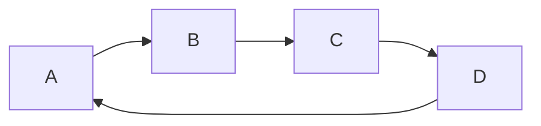

# Paper插件 (实验性)

Paper插件允许开发者利用Mojang引入的更现代的概念,比如数据包,来扩展Paper API能够引入的功能范围。

:::danger[实验性]

这是实验性的,可能会发生变化。

:::

- [引导程序](#bootstrapper)
- [加载器](#loaders)
- [差异](#differences)

## 如何使用它们?
与Bukkit插件类似,你需要在JAR资源文件夹中引入一个`paper-plugin.yml`文件。
这不会作为`plugin.yml`的直接替代品,因为如本指南所述,一些内容需要以不同的方式声明。

需要注意的是,你仍然可以在同一个JAR中同时包含`paper-plugin.yml`和`plugin.yml`。

这是一个示例配置:
<VersionFormattedCode language={"yaml"}>
```
name: Paper-Test-Plugin
version: '1.0'
main: io.papermc.testplugin.TestPlugin
description: Paper测试插件
api-version: '%%_MAJ_MIN_PAT_MC_%%'
bootstrapper: io.papermc.testplugin.TestPluginBootstrap
loader: io.papermc.testplugin.TestPluginLoader
```
</VersionFormattedCode>

### 依赖声明

Paper插件改变了在`paper-plugin.yml`中声明依赖的方式:

```yml
dependencies:
  bootstrap:
    # 假设RegistryPlugin注册了你的插件需要使用的一些数据
    # 我们在运行时不需要这个,所以在server部分不需要它。
    # 但是如果需要的话可以同时添加到两个部分
    RegistryPlugin:
      load: BEFORE
      required: true
      join-classpath: true # 默认为true
  server:
    # 添加一个必需的"RequiredPlugin"依赖,它将在你的插件之后加载。
    RequiredPlugin:
      load: AFTER
      required: true
      # 这意味着你的插件将无法访问它们的类路径
      join-classpath: false
```

在Paper插件中,依赖被分为两个部分:
- `bootstrap` - 这些是你将在[引导程序](#bootstrapper)中使用的依赖。
- `server` - 这些是用于插件核心功能的依赖,在服务器运行时使用。

让我们看一个依赖的例子:
```yml
RegistryPlugin:
  load: BEFORE # 默认为OMIT
  required: true # 默认为true
  join-classpath: true # 默认为true
```

- `load` (`BEFORE`|`AFTER`|`OMIT`): 这个插件应该在**你的**插件之前还是之后加载。注意:`OMIT`的加载顺序行为未定义。
- `required`: 这个插件对你的插件来说是否必需。
- `join-classpath`: 你的插件是否应该有权访问它们的类路径。这用于需要直接访问其他插件内部的插件。

:::note[循环加载]

注意在某些情况下,插件可能会引入循环加载循环,这将阻止服务器启动。
请阅读[循环加载指南](#cyclic-plugin-loading)了解更多信息。

:::

这里有几个例子:
```yml
# 假设我们需要ProtocolLib来加载我们的插件
ProtocolLib:
  load: BEFORE
  required: true

# 现在,我们要为商店插件注册一些详细信息
# 所以商店插件应该在我们的插件之后加载
SuperShopsXUnlimited:
  load: AFTER
  required: false

# 现在,我们需要访问一个插件的类路径
# 这样我们才能正确地与它交互。
SuperDuperTacoParty:
  required: true
  join-classpath: true
```

## 它用来做什么?
Paper插件为一些未来的API奠定了框架。我们的目标是开放更多与原版更好地对齐的现代API。Paper插件通过使用[引导程序](#bootstrapper)在服务器启动之前加载插件资源的新方式来实现这一点。

## 引导程序
Paper插件可以通过实现<Javadoc name={"io.papermc.paper.plugin.bootstrap.PluginBootstrap"}>`PluginBootstrap`</Javadoc>
并在`paper-plugin.yml`中的bootstrapper字段中添加你的实现类来标识它们自己的引导程序。
```java title="TestPluginBootstrap.java"
public class TestPluginBootstrap implements PluginBootstrap {

    @Override
    public void bootstrap(BootstrapContext context) {

    }

    @Override
    public JavaPlugin createPlugin(PluginProviderContext context) {
        return new TestPlugin("我的自定义参数");
    }

}
```
引导程序还允许你改变插件的初始化方式,允许你将值传递到插件构造函数中。
目前,引导程序不提供太多新的API,并且高度实验性。这可能会随着更多API的引入而改变。

## 加载器
Paper插件可以通过实现<Javadoc name={"io.papermc.paper.plugin.loader.PluginLoader"}>`PluginLoader`</Javadoc>
并在`paper-plugin.yml`中的loader字段中添加你的实现类来标识它们自己的插件加载器。

插件加载器的目标是为插件创建一个预期/动态的加载环境。
目前,这仅适用于为插件创建预期的类路径,例如为插件提供外部库。
```java title="TestPluginLoader.java"
public class TestPluginLoader implements PluginLoader {

    @Override
    public void classloader(PluginClasspathBuilder classpathBuilder) {
        classpathBuilder.addLibrary(new JarLibrary(Path.of("dependency.jar")));

        MavenLibraryResolver resolver = new MavenLibraryResolver();
        resolver.addDependency(new Dependency(new DefaultArtifact("com.example:example:version"), null));
        resolver.addRepository(new RemoteRepository.Builder("paper", "default", "https://repo.papermc.io/repository/maven-public/").build());

        classpathBuilder.addLibrary(resolver);
    }
}
```
目前,你可以添加两种不同的库类型:
<Javadoc name={"io.papermc.paper.plugin.loader.library.impl.JarLibrary"}>`JarLibrary`</Javadoc>和
<Javadoc name={"io.papermc.paper.plugin.loader.library.impl.MavenLibraryResolver"}>`MavenLibraryResolver`</Javadoc>。

## 差异

### Bukkit序列化系统
Paper插件仍然支持Bukkit使用的序列化系统(`org.bukkit.configuration.serialization`)。但是,自定义类不会自动注册以进行序列化。为了使用<Javadoc name={"org.bukkit.configuration.ConfigurationSection#getObject(java.lang.String,java.lang.Class)"}>`ConfigurationSection#getObject`</Javadoc>,
你**必须**在尝试从配置中获取对象之前调用<Javadoc name={"org.bukkit.configuration.serialization.ConfigurationSerialization#registerClass(java.lang.Class)"}>`ConfigurationSerialization#registerClass(Class)`</Javadoc>。

### 类加载隔离
除非通过依赖另一个插件等方式获得明确访问权限,否则Paper插件无法相互访问。这
有助于防止Paper插件意外访问彼此的依赖项,并且总的来说有助于确保
插件只能访问它们明确依赖的内容。

Paper插件可以通过在它们的`paper-plugin.yml`中添加`join-classpath`选项来绕过这一点,能够访问其他插件的类加载器。

```yml
Plugin:
  join-classpath: true # 意味着你可以访问它们的类路径
```

注意,其他Paper插件仍然无法访问你的类加载器。

### 加载顺序逻辑分离
为了更好地利用类加载隔离,Paper插件**不**使用`dependencies`字段来确定加载顺序。
这样做有多种原因,主要是为了允许更好的控制并允许插件正确共享类加载器。

有关如何声明插件加载顺序的更多信息,请参见[声明依赖](#dependency-declaration)。

### 命令
Paper插件不使用`commands`字段来注册命令。这意味着你不需要在`paper-plugin.yml`文件中包含所有
命令。相反,你可以使用[Brigadier命令API](../api/command-api/basics/introduction.mdx)来注册命令。

### 循环插件加载

循环加载描述了当插件加载导致一个最终循环回到原始插件的循环时的现象。
与Bukkit插件不同,Paper插件不会尝试解决循环加载问题。



但是,如果Paper检测到一个无法解决的循环,你会得到一个这样的错误:
```
[ERROR]: [LoadOrderTree] =================================
[ERROR]: [LoadOrderTree] 检测到循环插件加载:
[ERROR]: [LoadOrderTree] 1) Paper-Test-Plugin1 -> Paper-Test-Plugin -> Paper-Test-Plugin1
[ERROR]: [LoadOrderTree]    Paper-Test-Plugin1 loadbefore: [Paper-Test-Plugin]
[ERROR]: [LoadOrderTree]    Paper-Test-Plugin loadbefore: [Paper-Test-Plugin1]
[ERROR]: [LoadOrderTree] 请向每个循环中第一个插件的作者报告此问题,或加入PaperMC Discord服务器寻求进一步帮助。
[ERROR]: [LoadOrderTree] =================================
```

解决这些循环加载问题取决于你。
