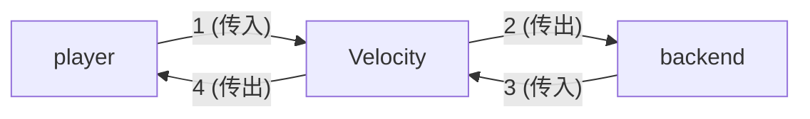
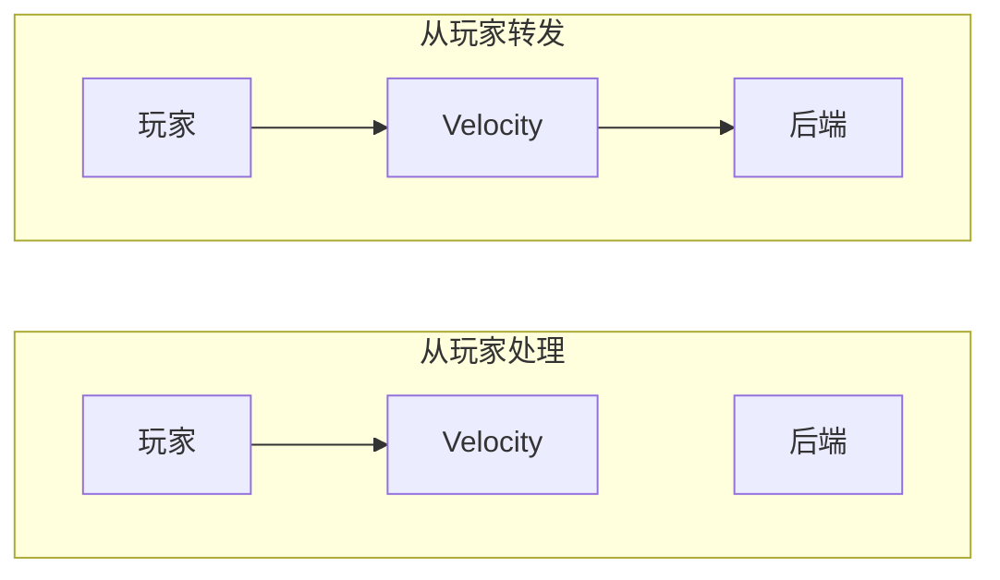
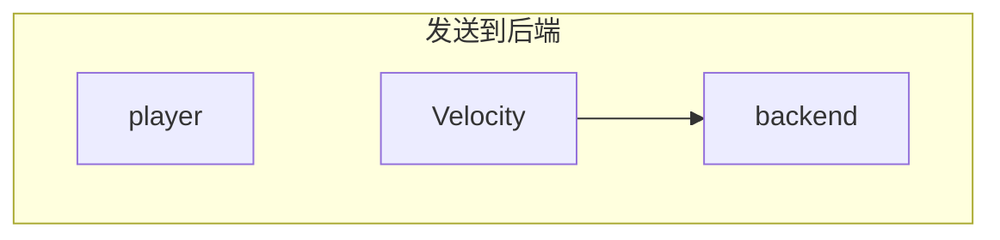
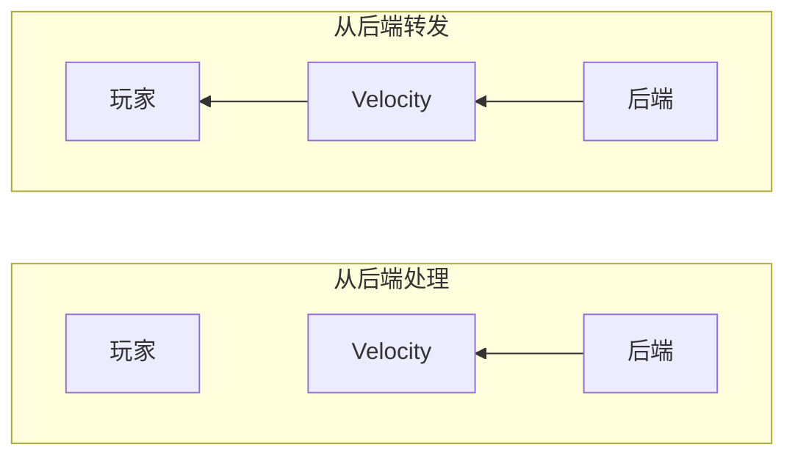
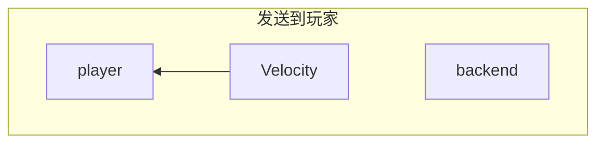

# 插件消息

最早在 [2012 年](https://web.archive.org/web/20220711204310/https://dinnerbone.com/blog/2012/01/13/minecraft-plugin-channels-messaging/)引入，
插件消息是 Velocity 插件与客户端和后端服务器通信的一种方式。

Velocity 管理双向连接，既包括客户端也包括后端服务器。
这意味着 Velocity 插件需要考虑 4 个主要情况：



:::warning

当监听 `PluginMessageEvent` 时，如果你不打算让客户端参与，请确保结果是
<Javadoc name={"com/velocitypowered/api/event/connection/PluginMessageEvent$ForwardResult#handled()"} project={"velocity"}>`ForwardResult.handled()`</Javadoc>。

如果结果被转发，玩家可以向你的后端服务器冒充代理服务器。

此外，确保在实际处理正确消息后正确设置结果，以防止它们泄露给另一方。

这可以通过在检查标识符和检查源之间无条件设置结果来实现，如示例所示。

:::

此外，包含了 BungeeCord 通道兼容性，这在某些情况下可能不需要配套的 Velocity 插件。

## 情况 1：从玩家接收插件消息

这是当你需要处理或检查玩家发送的插件消息的内容时。
它需要在 ChannelRegistrar 中注册才能触发事件。

一个用例可能是记录报告已启用功能的模组的消息。




```java
public static final MinecraftChannelIdentifier IDENTIFIER = MinecraftChannelIdentifier.from("custom:main");

@Subscribe
public void onProxyInitialization(ProxyInitializeEvent event) {
    proxyServer.getChannelRegistrar().register(IDENTIFIER);
}

@Subscribe
public void onPluginMessageFromPlayer(PluginMessageEvent event) {
    // 首先检查标识符是否匹配，无论来源如何。
    if (!IDENTIFIER.equals(event.getIdentifier())) {
        return;
    }

    // 将 PluginMessage 标记为已处理，表示内容
    // 不应该转发到它们的原始目的地。
    event.setResult(PluginMessageEvent.ForwardResult.handled());

    // 或者：

    // 将 PluginMessage 标记为已转发，表示内容
    // 应该被传递，就像 Velocity 不存在一样。
    //event.setResult(PluginMessageEvent.ForwardResult.forward());

    // 只有当来源是玩家时才尝试解析数据
    if (!(event.getSource() instanceof Player player)) {
        return;
    }

    ByteArrayDataInput in = ByteStreams.newDataInput(event.getData());
    // 处理数据包数据
}
```

## 情况 2：向后端服务器发送插件消息

这是当你需要向后端服务器发送插件消息时。

有两种方法可以向后端发送插件消息，具体取决于你需要实现什么。

:::warning

在你的后端服务器上，只有在确保只有受信任的代理可以向你的服务器发送消息时，才监听插件消息。

否则，玩家可以假装是你的代理服务器，并伪造这些消息。

:::




### 使用任何已连接的玩家

如果你只想传达与整个服务器相关的内容，或者可以从其内容中推导出的内容，这很有用。

一个用例可能是告诉服务器关闭。

```java
public boolean sendPluginMessageToBackend(RegisteredServer server, ChannelIdentifier identifier, byte[] data) {
    // 成功时返回 true
    return server.sendPluginMessage(identifier, data);
}
```

### 使用特定玩家的连接

如果你想向他们当前的后端服务器传达关于特定玩家的内容，这很有用。
你可能需要额外的检查来确保它会在玩家所在的后端正确处理。

一个用例可能是告诉后端服务器给玩家一个特定的物品。

```java
public boolean sendPluginMessageToBackendUsingPlayer(Player player, ChannelIdentifier identifier, byte[] data) {
    Optional<ServerConnection> connection = player.getCurrentServer();
    if (connection.isPresent()) {
        // 成功时返回 true
        return connection.get().sendPluginMessage(identifier, data);
    }
    return false;
}
```

## 情况 3：从后端服务器接收插件消息

这是当你需要从后端服务器接收插件消息时。
它需要在 <Javadoc name={"com.velocitypowered.api.proxy.messages.ChannelRegistrar"} project={"velocity"}>`ChannelRegistrar`</Javadoc>
中注册才能触发事件。

一个用例可能是处理将玩家传送到另一个服务器的请求。



```java
public static final MinecraftChannelIdentifier IDENTIFIER = MinecraftChannelIdentifier.from("custom:main");

@Subscribe
public void onProxyInitialization(ProxyInitializeEvent event) {
    proxyServer.getChannelRegistrar().register(IDENTIFIER);
}

@Subscribe
public void onPluginMessageFromBackend(PluginMessageEvent event) {
    // 首先检查标识符是否匹配，无论来源如何。
    // 这允许将所有 IDENTIFIER 消息设置为已处理，
    // 防止任何来自客户端的消息被转发。
    if (!IDENTIFIER.equals(event.getIdentifier())) {
        return;
    }

    // 将 PluginMessage 标记为已处理，表示内容
    // 不应该转发到它们的原始目的地。
    event.setResult(PluginMessageEvent.ForwardResult.handled());

    // 或者：

    // 将 PluginMessage 标记为已转发，表示内容
    // 应该被传递，就像 Velocity 不存在一样。
    //
    // 这应该非常谨慎使用，
    // 因为任何客户端都可以自由发送任何它想要的内容，假装是代理服务器
    //event.setResult(PluginMessageEvent.ForwardResult.forward());

    // 只有当来源是后端服务器时才尝试解析数据
    if (!(event.getSource() instanceof ServerConnection backend)) {
        return;
    }

    ByteArrayDataInput in = ByteStreams.newDataInput(event.getData());
    // 处理数据包数据
}
```

## 情况 4：向玩家发送插件消息

这是当你需要向玩家发送插件消息时。

:::tip

这只在你正在制作客户端模组时才真正有用。否则，玩家可能只会忽略该消息。

:::



```java
public boolean sendPluginMessageToPlayer(Player player, ChannelIdentifier identifier, byte[] data) {
    // 成功时返回 true
    return player.sendPluginMessage(identifier, data);
}
```

## BungeeCord 通道兼容性

这允许你的后端服务器以与 BungeeCord 兼容的方式与 Velocity 通信。

默认情况下，如果在[配置](/velocity/configuration#advanced-section)中启用了 `bungee-plugin-message-channel`，
你的 Velocity 服务器将响应 `bungeecord:main` 通道。

:::tip["bungeecord" 规范]

查看[这里](/paper/dev/plugin-messaging#plugin-message-types)了解 BungeeCord / Velocity 支持的所有内置插件消息列表。

:::
