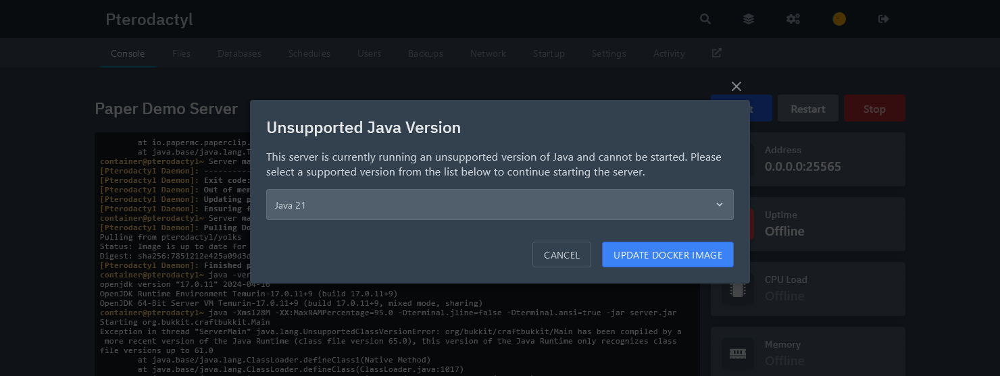
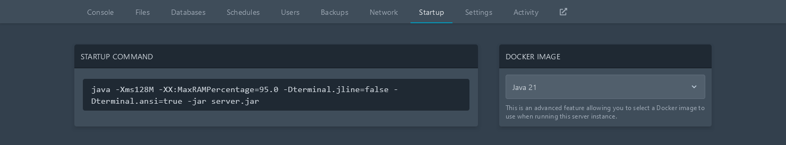

安装 Java 是使用或开发 Paper 和 Velocity 插件的关键第一步。
本指南将为您介绍大多数主要平台上推荐的安装步骤。

:::caution[不要使用无头（headless）版本的 Java！]

有一些 Java 的 `headless` 变体，它们的包名通常带有 `-headless` 后缀。
这些变体缺少 Paper 所需的依赖项。因此，不建议使用它们。

:::

:::tip

本指南主要介绍 Amazon 的 Corretto OpenJDK 发行版。这是因为它在大多数平台上提供了
最好的安装体验。然而，Corretto 并不是唯一可选的 OpenJDK 供应商。
还有许多替代选择，如 [Eclipse Adoptium](https://adoptium.net/)、
[Microsoft](https://www.microsoft.com/openjdk) 和
[Azul Zulu](https://www.azul.com/downloads/?package=jdk)。请注意，虽然 Oracle 分发的 JDK
在功能上是相同的，但由于其安装程序极不友好且之前的许可证政策不友好，因此**不**推荐使用。

:::

## Linux

### Ubuntu/Debian

在基于 Debian 的 Linux 发行版上安装 Java 21 非常简单。首先，确保您的系统有
所有成功安装 Java 所需的工具。

```bash
sudo apt-get update && sudo apt-get upgrade
sudo apt-get install ca-certificates apt-transport-https gnupg wget
```

其次，导入 Amazon Corretto 公钥和 apt 仓库。

```bash
wget -O - https://apt.corretto.aws/corretto.key | sudo gpg --dearmor -o /usr/share/keyrings/corretto-keyring.gpg && \
echo "deb [signed-by=/usr/share/keyrings/corretto-keyring.gpg] https://apt.corretto.aws stable main" | sudo tee /etc/apt/sources.list.d/corretto.list
```

然后，使用以下命令安装 Java 21 和其他依赖项：

```bash
sudo apt-get update
sudo apt-get install -y java-21-amazon-corretto-jdk libxi6 libxtst6 libxrender1
```

继续[验证您的安装](#验证安装)。

### 基于 RPM 的系统

要在 CentOS、RHEL、Fedora、openSUSE、SLES 或任何其他基于 RPM 的 Linux
发行版上安装 Java 21，请根据您的包管理器执行以下命令。完成后，
继续[验证您的安装](#验证安装)。

#### DNF

DNF 用于 Fedora、CentOS/RHEL 7+ 及相关发行版。

```bash
sudo rpm --import https://yum.corretto.aws/corretto.key
sudo curl -Lo /etc/yum.repos.d/corretto.repo https://yum.corretto.aws/corretto.repo
sudo dnf -y install java-21-amazon-corretto-devel
```

#### Zypper

Zypper 用于 openSUSE、SLE 及相关发行版。

由于不能直接用 Zypper 导入 YUM 软件库，因此暂时以系统官方所提供软件源的软件作为演示。

```bash
sudo zypper in java-21-openjdk
```

#### YUM

YUM 用于较旧版本的 CentOS/RHEL 和非常旧的 Fedora 版本。

```bash
sudo rpm --import https://yum.corretto.aws/corretto.key
sudo curl -Lo /etc/yum.repos.d/corretto.repo https://yum.corretto.aws/corretto.repo
sudo yum -y install java-21-amazon-corretto-devel
```

## Windows 10 和 11

如果您使用的是 Windows 10 或 11，安装 Java 就像安装任何其他程序一样。从
[他们的网站](https://corretto.aws/downloads/latest/amazon-corretto-21-x64-windows-jdk.msi)
下载 Amazon Corretto 安装程序。

运行安装程序后，可以安全地一直点击"下一步"完成整个过程。不会安装任何额外的
广告软件或工具栏，所有必需的功能都已默认启用。

现在，打开命令提示符并继续[验证您的安装](#验证安装)。

## macOS/OS X

如果您使用的是 macOS，管理 Java 安装的最佳方式是使用一个名为
[Homebrew](https://brew.sh) 的工具。按照他们主页上的说明进行安装。然后，在您的
终端中运行以下命令：

```bash
brew install openjdk@21
```

此命令完成后，继续[验证您的安装](#验证安装)。

## Pterodactyl

:::note

在低于 `1.2.0` 版本的 Pterodactyl 上，需要管理员账户才能更改 Java
版本。这些说明将不适用。

:::

如果您使用了错误的 Java 版本启动 Paper 服务器，Pterodactyl 将自动
提示您更新，如下所示：



如果您没有看到这个提示，可以手动更改 Java 版本。导航到服务器的
"Startup"（启动）选项卡，从"Docker Image"（Docker 镜像）
下拉菜单中选择 `Java 21`，如下图所示。



:::note

如果您在下拉菜单中没有看到 `Java 21`，需要管理员账户来更新 Paper egg。

:::

验证安装部分不适用于 Pterodactyl。

## 验证安装

现在您已经安装了 Java 21，在终端中运行此命令以确保安装过程
成功。

```bash
java -version
```

输出应该类似于这样。需要注意的重要部分是它以 `openjdk 21` 开头，
并且在最后一行包含 `64-Bit`。如果您得到的输出类似于
`java: command not found`，请尝试创建一个新的终端会话。

```
openjdk version "21" 2023-09-19 LTS
OpenJDK Runtime Environment Corretto-21.0.0.35.1 (build 21+35-LTS)
OpenJDK 64-Bit Server VM Corretto-21.0.0.35.1 (build 21+35-LTS, mixed mode, sharing)
```

如果您的安装失败了，请不要犹豫，在我们的 [Discord](https://discord.gg/papermc) 的
`#paper-help` 频道寻求支持。
