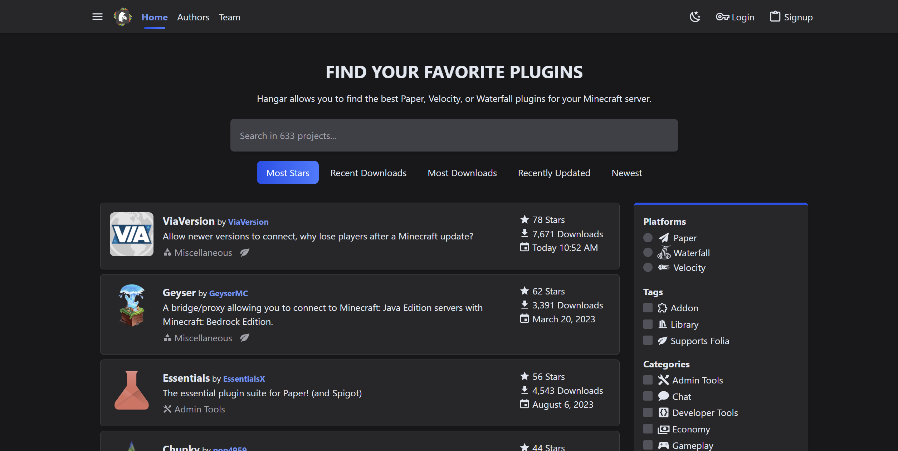

# 下一步

现在您的服务器已经启动并运行，有一些事情您应该做以确保服务器运行顺畅。

## 配置

您应该做的第一件事之一是确保您的服务器按照您的规格进行配置。
Paper 具有高度的可配置性，您可以更改许多设置以满足您的需求。我们在
[配置](/paper/reference/configuration)指南中概述了在哪里可以找到这些设置。

## 插件

使用 Paper 的主要原因之一是利用使用我们广泛 API 的众多插件。我们有自己的插件仓库
[Hangar](https://hangar.papermc.io/)，您可以在那里找到许多可以在服务器上使用的插件。
我们还有一个关于如何安装插件的指南[在这里](/paper/adding-plugins)。

## 安全

### 白名单

如果您想限制谁可以加入您的服务器，您可以使用白名单功能。这允许您指定谁可以
加入您的服务器，并阻止其他人加入。您可以从服务器控制台使用白名单，
或通过编辑服务器目录中的 `whitelist.json` 文件。

### 权限

权限是一种控制玩家在服务器上可以和不可以做什么的方式。您可以使用权限来限制
谁可以使用某些命令，或谁可以访问服务器的某些区域。插件通常使用权限来控制
谁可以使用它们的功能。您可以使用权限插件，如 [LuckPerms](https://luckperms.net/)，
来管理将授予玩家的权限。

## 备份

保持服务器的备份很重要。如果出现问题，您可以将服务器恢复到以前的
状态。我们在[更新](/paper/updating)指南中介绍了如何做到这一点。

## 优化

开箱即用，Paper 已经针对性能进行了优化。但是，您还可以做很多事情来进一步
优化您的服务器。最常见的事情之一是确保您为服务器运行正确的启动标志。
我们有一个工具，可以自动生成带有适合您服务器的正确标志的启动脚本。
您可以在[这里](/misc/tools/start-script-gen)找到这个工具。除此之外，像
[这样的指南](https://paper-chan.moe/paper-optimization/)将帮助您进一步优化您的服务器。

## 公开您的服务器

如果您想公开您的服务器，您需要为服务器进行端口转发。这允许网络外的人
连接到您的服务器。[NordVPN](https://nordvpn.com/blog/open-ports-on-router/) 制作了一个指南，
解释了什么是端口转发以及如何为您的 Paper 服务器进行设置。

## 故障排除

如果您遇到服务器的任何问题，您可以按照我们的[故障排除](/paper/basic-troubleshooting)
指南来帮助您诊断和修复问题。如果您无法修复问题，您可以来到我们的
[Discord](https://discord.gg/papermc) 服务器寻求帮助！
