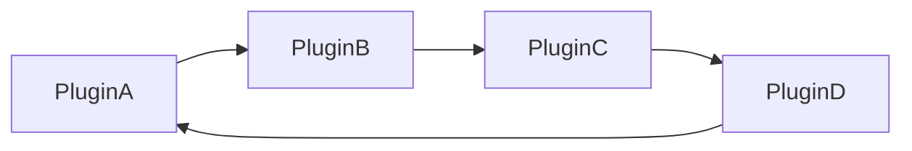

# Bukkit Plugin YML

`plugin.yml`文件是你的插件的主要配置文件。
它包含了关于你的插件的信息,如名称、版本和描述。
它还包含了插件的依赖、权限和命令的信息。

`plugin.yml`文件位于项目的`resources`目录中。
```
example-plugin
├── build.gradle.kts
├── settings.gradle.kts
└── src
    └── main
        ├── java
        └── resources
            └── plugin.yml
```

## 示例

这是一个`plugin.yml`文件的示例:

<VersionFormattedCode language={"yaml"}>
```
name: ExamplePlugin
version: 1.0.0
main: io.papermc.testplugin.ExamplePlugin
description: 一个示例插件
author: PaperMC
website: https://papermc.io
api-version: '%%_MAJ_MIN_PAT_MC_%%'
```
</VersionFormattedCode>

## 字段

:::note

本节中的字段没有特定顺序。
如果它们旁边有星号(\*),则表示它们是必需的。

:::

### name*

你的插件的名称。这将显示在插件列表和日志消息中。
如果设置了prefix,这将在日志中被覆盖。
- `name: ExamplePlugin`

### version*

插件的当前版本。这会显示在插件信息消息和服务器日志中。
- `version: 1.0.0`

### main*

你的插件的主类。这是继承`JavaPlugin`的类,也是你的插件的入口点。
- `main: io.papermc.testplugin.ExamplePlugin`

这是你的主类的包路径和类名。

### description

你的插件的简短描述及其功能。这将显示在插件信息命令中。
- `description: 一个示例插件`

### author / authors

插件的作者。这可以是单个作者或作者列表。
- `author: PaperMC`
- `authors: [PaperMC, SpigotMC, Bukkit]`
这些将显示在插件信息命令中。

### contributors

不是管理作者的插件贡献者。
- `contributors: [PaperMC, SpigotMC, Bukkit]`
这些将显示在插件信息命令中。

### website

插件的网站。这对于链接到GitHub仓库或插件页面很有用。
- `website: https://papermc.io`
这将显示在插件信息命令中。

### api-version

你的插件使用的Paper API版本。这不包括1.20.5之前的次要版本。从1.20.5开始,支持次要版本。
版本低于此处指定版本的服务器将拒绝加载插件。
有效版本是1.13 - <SoftwareVersion versionType={"maj-min-pat"}/>。
- <VersionFormattedCode>`api-version: '%%_MAJ_MIN_PAT_MC_%%'`</VersionFormattedCode>

:::info

如果未指定此项,插件将作为旧版插件加载,并且会在控制台中打印警告。

:::

### load

这告诉服务器何时加载插件。这可以是`STARTUP`或`POSTWORLD`。如果未指定,默认为`POSTWORLD`。
- `load: STARTUP`

### prefix

插件的前缀。这是将在日志中显示的内容,而不是插件名称。
- `prefix: EpicPaperMCHypePlugin`

### libraries

:::warning

使用此功能*目前*违反了Maven Central的服务条款。但是,此功能很可能会保留。

:::

这是你的插件依赖的库列表。这些库将从Maven Central仓库下载并添加到类路径中。
这消除了需要shade和重定位库的需求。

```yaml
libraries:
  - com.google.guava:guava:30.1.1-jre
  - com.google.code.gson:gson:2.8.6
```

### permissions

这是你的插件使用的权限列表。这对于使用权限来限制某些功能访问的插件很有用。
```yaml
permissions :
    permission.node:
        description: "这是一个权限节点"
        default: op
        children:
            permission.node.child: true
    another.permission.node:
        description: "这是另一个权限节点"
        default: not op
```

description是权限节点的描述。这是将在权限列表中显示的内容。
default是权限节点的默认值。这可以是`op`/`not op`或`true`/`false`。
如果未指定,则默认为`default-permission`的值,而`default-permission`默认为`op`。
每个权限节点可以有子节点。当设置为`true`时,它将继承父权限。

### default-permission

未指定`default`的权限将具有的默认值。这可以是`op`/`not op`或`true`/`false`。
- `default-permission: true`

## 命令

这是你的插件使用的命令列表。这对于使用命令来提供功能的插件很有用。
```yaml
commands:
    command:
        description: "这是一个命令"
        usage: "/command <arg>"
        aliases: [cmd, command]
        permission: permission.node
        permission-message: "你没有使用此命令的权限"
```

- `description`是命令的描述。这给出了命令功能的简短描述。
- `usage`是命令的用法。这是当玩家使用`/help <command>`时将显示的内容。
- `aliases`是命令可以使用的别名列表。这对于缩短命令很有用。
- `permission`是玩家需要使用命令的权限节点。注意:玩家只会看到他们有权限使用的命令。
- `permission-message`是当玩家没有使用命令的权限时将显示的消息。

## 依赖

:::warning[依赖循环]

如果将插件指定为依赖项,它将在你的插件之前加载。
要小心,因为如果出现循环依赖,这些可能会导致插件加载问题。循环依赖可以如下图所示:



其中`PluginA`和`PluginB`是相互依赖的插件。

:::

### depend

你的插件需要__加载__的插件列表。它们通过插件名称指定。

:::info

如果找不到插件,你的插件将不会加载。

:::

- `depend: [Vault, WorldEdit]`

### softdepend

你的插件需要__完整功能__的插件列表。它们通过插件名称指定。

- `softdepend: [Vault, WorldEdit]`

### loadbefore

你的插件应该在__之前__加载的插件列表。它们通过插件名称指定。
如果你想在另一个插件使用你的插件的API之前加载你的插件,这很有用。

- `loadbefore: [Vault, FactionsUUID]`

### provides

这可以用来告诉服务器此插件将提供某些库或其他插件的功能(如别名系统)。
(软)依赖于其他插件的插件在解析依赖关系或使用
<Javadoc name={"org.bukkit.plugin.PluginManager#getPlugin(java.lang.String)"}>`PluginManager#getPlugin(String)`</Javadoc>时,
会将你的插件视为其他插件存在。
- `provides: [SomeOtherPlugin]`
