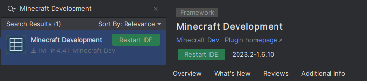
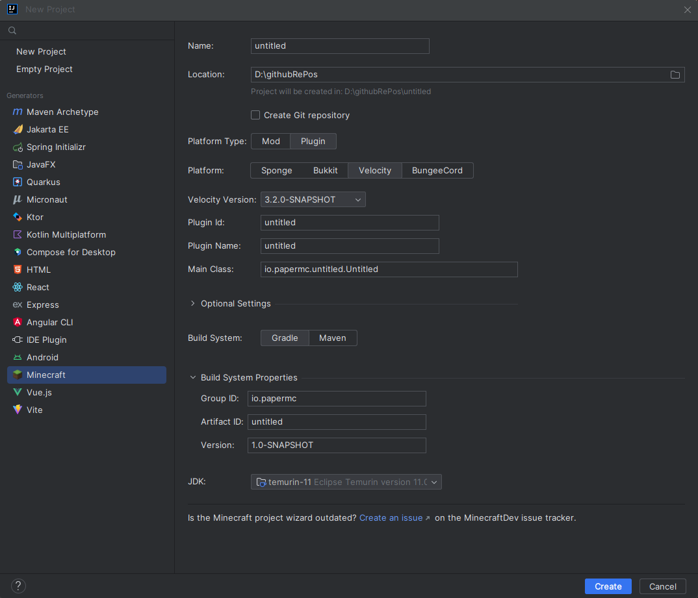

import Tabs from '@theme/Tabs';
import TabItem from '@theme/TabItem';

# 创建你的第一个插件

为 Velocity 创建插件非常简单。本节将教你如何设置你的 IDE、插件标识符，并为你介绍 Velocity API 的基础知识。

## 在继续之前...

你需要熟练掌握 Java 编程语言。如果你还不会 Java，我们强烈建议你在继续之前先学习一些基础的 Java 知识。

## 设置你的环境

你需要 [JDK](/misc/java-install) 和一个 IDE。如果你没有 IDE，推荐使用 IntelliJ IDEA。

## 在你的 IDE 中创建项目

- 打开你的 IDE
- 点击 `创建新项目` 或类似选项
- 选择 `Gradle` 或 `Maven`
- 确保你的 **Project JDK** 是 Java <Property name="VELOCITY_JAVA_MIN" /> 或更高版本
- **完成**对话框并打开项目。

现在我们已经创建了项目，我们需要配置我们的构建系统。

## 我知道怎么做。给我需要的东西！

### Maven 仓库

| 名称      | URL                                                |
|-----------|----------------------------------------------------|
| `papermc` | `https://repo.papermc.io/repository/maven-public/` |

### 依赖

| Group ID              | Artifact ID    | Version                                                              |
|-----------------------|----------------|----------------------------------------------------------------------|
| `com.velocitypowered` | `velocity-api` | <VersionFormattedCode>`%%_MAJ_MIN_PAT_VEL_%%`</VersionFormattedCode> |

### Javadocs

Javadocs 可在 <Javadoc project={"velocity"}>jd.papermc.io</Javadoc> 获取。

## 设置你的构建系统

在继续之前，你需要设置一个构建系统。虽然可以不使用构建系统编写 Velocity 插件，
但有一个构建系统会让你的生活轻松很多。

如何设置构建系统超出了本页面的范围，但你可以查看你的构建系统的文档
（[Gradle](https://docs.gradle.org/current/userguide/userguide.html) 或
[Maven](https://maven.apache.org/guides/getting-started/index.html)）以获取帮助。

### 设置依赖

<Tabs groupId="author-front-matter">
  <TabItem value="maven" label="Maven POM">

<VersionFormattedCode language={"xml"} title={"pom.xml"}>
```
<project>
    <repositories>
        <repository>
            <id>papermc</id>
            <url>https://repo.papermc.io/repository/maven-public/</url>
        </repository>
    </repositories>

    <dependencies>
        <dependency>
            <groupId>com.velocitypowered</groupId>
            <artifactId>velocity-api</artifactId>
            <version>%%_MAJ_MIN_PAT_VEL_%%</version>
            <scope>provided</scope>
        </dependency>
    </dependencies>
</project>
```
</VersionFormattedCode>

  </TabItem>
  <TabItem value="gradle-kotlin" label="Gradle Kotlin DSL" default>

<VersionFormattedCode language={"kotlin"} title={"build.gradle.kts"}>
```
repositories {
    maven {
        name = "papermc"
        url = uri("https://repo.papermc.io/repository/maven-public/")
    }
}

dependencies {
    compileOnly("com.velocitypowered:velocity-api:%%_MAJ_MIN_PAT_VEL_%%")
    annotationProcessor("com.velocitypowered:velocity-api:%%_MAJ_MIN_PAT_VEL_%%")
}
```
</VersionFormattedCode>

  </TabItem>
  <TabItem value="gradle-groovy" label="Gradle Groovy DSL">

<VersionFormattedCode language={"groovy"} title={"build.gradle"}>
```
repositories {
    maven {
        name = 'papermc'
        url = 'https://repo.papermc.io/repository/maven-public/'
    }
}

dependencies {
    compileOnly 'com.velocitypowered:velocity-api:%%_MAJ_MIN_PAT_VEL_%%'
    annotationProcessor 'com.velocitypowered:velocity-api:%%_MAJ_MIN_PAT_VEL_%%'
}
```
</VersionFormattedCode>

  </TabItem>
</Tabs>

## 使用 Minecraft Development IntelliJ 插件

或者，你可以使用 [Minecraft Development IntelliJ 插件](https://plugins.jetbrains.com/plugin/8327-minecraft-development)
来创建新项目。要做到这一点，你需要先安装该插件。

:::info

本教程仅适用于 IntelliJ IDEA。如果你使用其他 IDE，请按照上面描述的手动项目设置指南进行操作。

:::

### 安装 Minecraft Development 插件

首先你需要安装 [Minecraft Development](https://plugins.jetbrains.com/plugin/8327-minecraft-development) 插件。
你可以通过转到 `File > Settings > Plugins` 并在 `Marketplace` 部分搜索 `Minecraft Development` 来完成此操作。


安装插件后，你需要重启 IntelliJ。
要做到这一点，你可以点击安装插件后出现的 `Restart IDE` 按钮。



### 创建新项目

现在你已经安装了插件，你可以通过转到 `File > New > Project...` 并从选项列表中选择 `Minecraft` 来创建新项目。

### 设置 Velocity 项目



你将被要求提供一些关于你的项目的信息。

| 字段                | 说明                                                                                                                                                                                                                                                                  |
|----------------------|---------------------------------------------------------------------------------------------------------------------------------------------------------------------------------------------------------------------------------------------------------------------------|
| **Name**             | 你的项目名称。                                                                                                                                                                                                                                                          |
| **Location**         | 你的项目位置。这是项目文件将被存储的位置。                                                                                                                                                                                                                              |
| **Platform Type**    | 你要开发的平台类型。应该选择 `Plugin`。                                                                                                                                                                                                                                |
| **Platform**         | 你要开发的平台。应该选择 `Velocity`。                                                                                                                                                                                                                                  |
| **Velocity Version** | 你要开发的 Velocity 版本。                                                                                                                                                                                                                                              |
| **Plugin Id**        | 你的插件 ID。                                                                                                                                                                                                                                                           |
| **Plugin Name**      | 你的插件名称。                                                                                                                                                                                                                                                          |
| **Main Class**       | 你的插件的主类。这个类应该有 `@Plugin` 注解。                                                                                                                                                                                                                          |
| **Optional Setting** | 在这里你可以定义作者、网站、描述等内容。这些是可选的，插件工作不需要这些。                                                                                                                                                                                              |
| **Build System**     | 你想使用的构建系统。Paper 推荐使用 Gradle，但如果你喜欢也可以使用 Maven。                                                                                                                                                                                              |
| **Group ID**         | 你的项目的组 ID。这用于 Maven 和 Gradle。通常是你的域名反转。如果你不知道应该填什么，可以使用类似 `io.github.<你的名字>` 的格式，或者如果你没有 GitHub，也可以直接使用 `me.<你的名字>`。                                                                                |
| **Artifact ID**      | 你的项目的构件 ID。这用于 Maven 和 Gradle。通常是你的项目名称。通常与 `Name` 字段相同。                                                                                                                                                                                |
| **Version**          | 你的项目版本。这用于 Maven 和 Gradle。通常是 `1.0-SNAPSHOT`，现在并不重要。                                                                                                                                                                                            |
| **JDK**              | 你想使用的 JDK。可以是 Java <Property name="VELOCITY_JAVA_MIN" /> 及以上的任何版本。                                                                                                                                                                                   |

现在你可以点击 `Create` 按钮，IntelliJ 将为你创建项目。
如果一切顺利，你应该看到类似这样的内容：


## 结论

现在你应该已经设置好了一个带有 Velocity 依赖的项目。
你剩下要做的就是编译你的插件并在 Velocity 服务器上运行它。

:::note

如果你想简化插件测试过程，你可以使用 [Run-Task](https://github.com/jpenilla/run-task) Gradle 插件。
它会自动下载一个 Velocity 服务器并为你运行它。

:::

:::info

如果你使用 IntelliJ，你可以使用 IDE 右上角的 Gradle GUI `Build` 菜单来编译你的插件。
你的插件的输出 JAR 将在 `build/libs` 目录中。

:::
